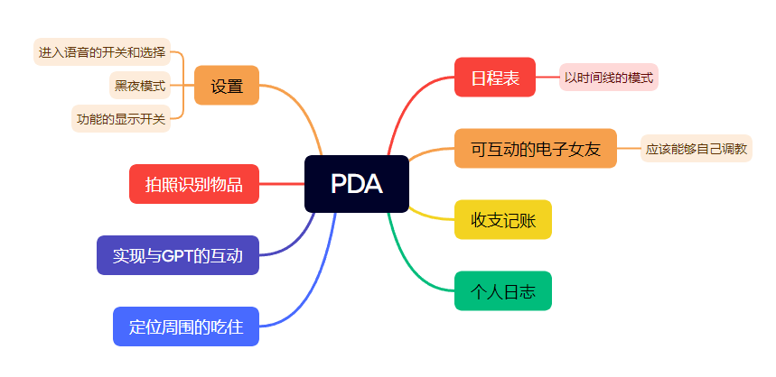

# PDA(Personal-Digital-Assistant) 个人数字助手

## 简介

顾名思义的东西,在软件层面上实现一个 个人数字助手，不同于硬件的数字助手，该软件旨在提供便利的日常需求服务。你可以在有疑问的时候询问PDA，你也可以在PDA上进行自己的时间规划或者进行日志编写等功能。PDA永远是您最忠实的个人助理。

## 技术栈

安卓开发

## 功能

## 计划

1. 实现和月下老婆的互动，文字聊天，语音聊天。
2. 实现个人老婆的自己调教（但愿可以吧

